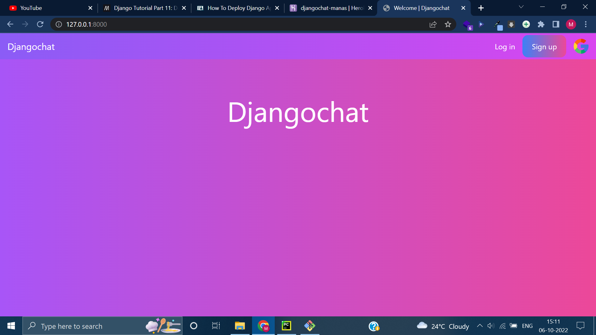
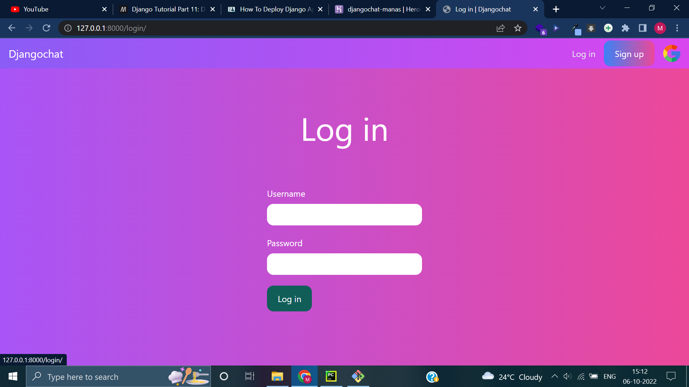
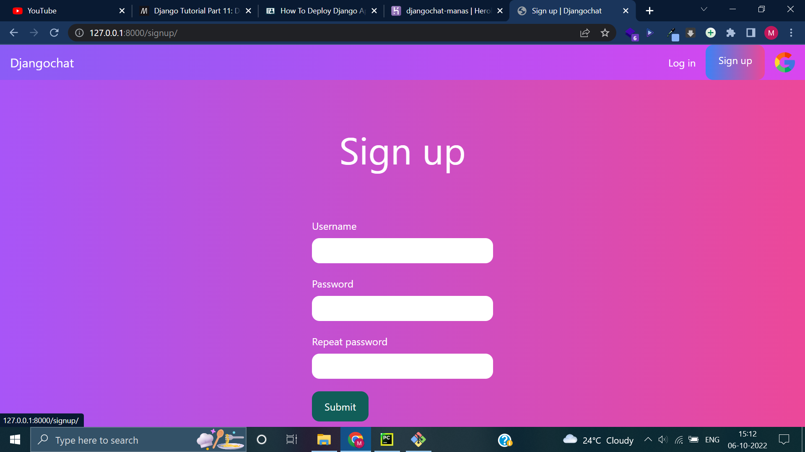
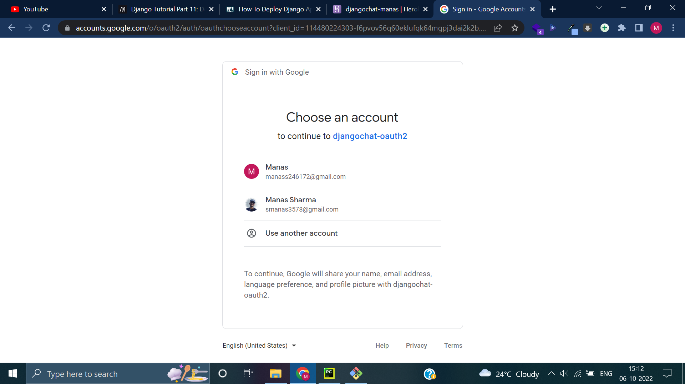
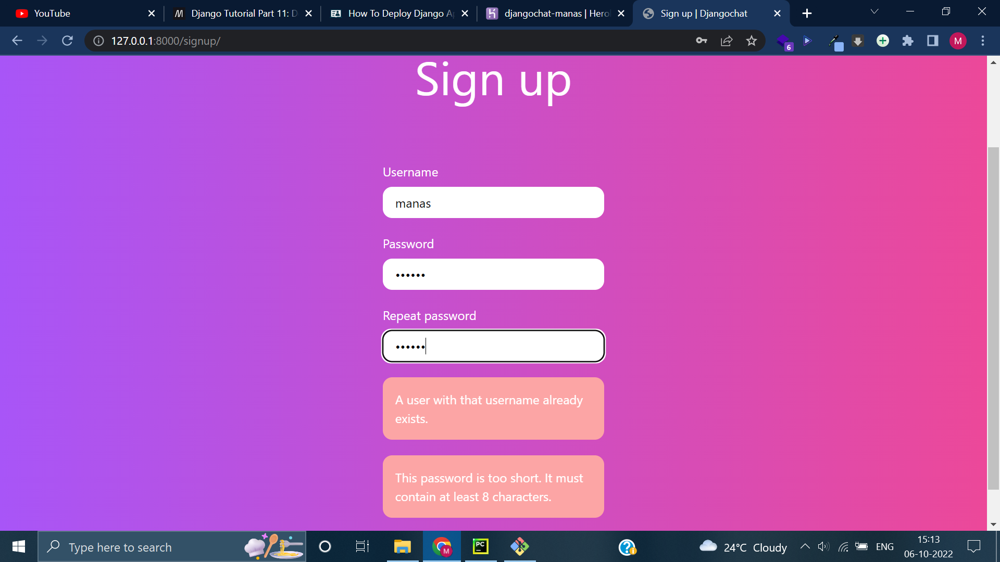
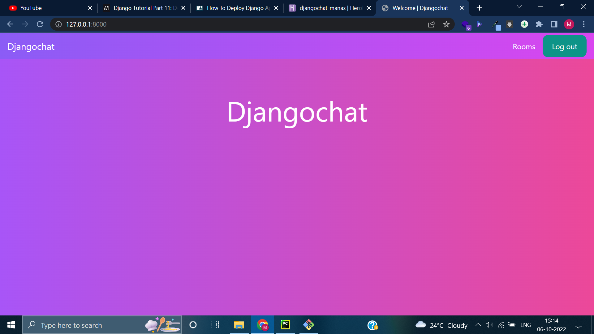
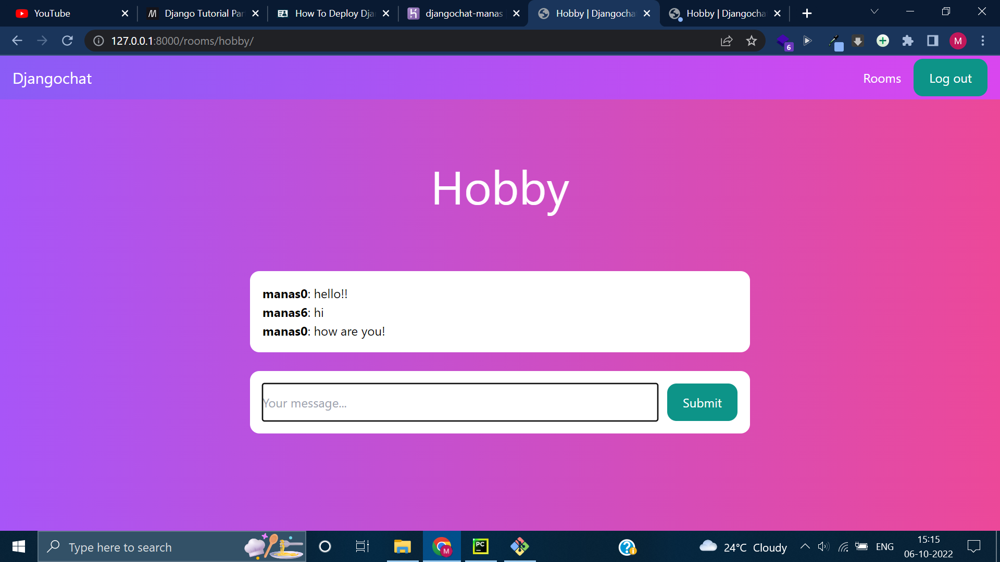
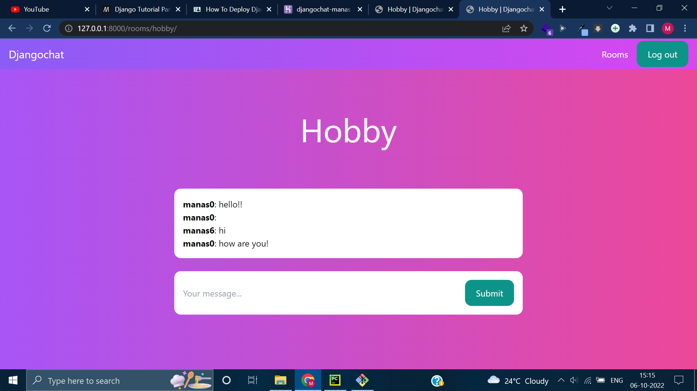

# Django chat-app

This is a  repository containing code and other resources for chat-application as a 
part of hiring drive for Palo Alto Networks, DIT University.

Heroku link:
[Heroku dashboard](https://dashboard.heroku.com/apps/djangochat-manas)

## Output screenschots
This repository and video is created by CodeWithStein. Check out my website for more information.

